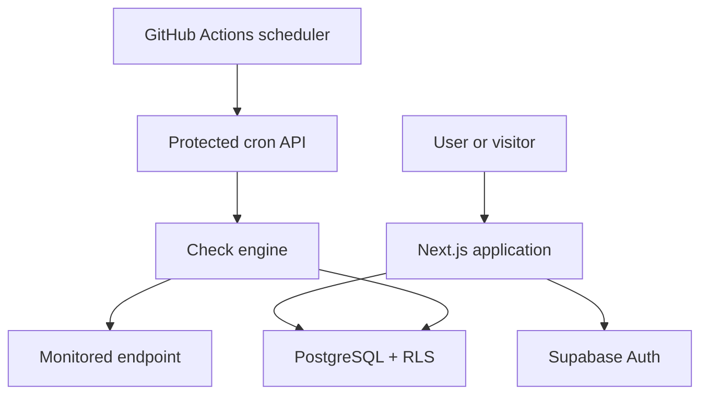

# PulseCheck

> A production-deployed website and API uptime monitor with scheduled health checks, incident tracking, response-time analytics, and public status pages.

[](https://pulse-check-sigma-two.vercel.app)
[](https://nextjs.org/)
[](https://www.typescriptlang.org/)
[](https://supabase.com/)
[](#testing)

**[Try the live application](https://pulse-check-sigma-two.vercel.app)**

## Why I built it

When a website or API fails, developers need to know whether it is unavailable, responding slowly, or returning the wrong status code. PulseCheck continuously tests configured endpoints, preserves their history, and turns repeated failures into trackable incidents—all from one dashboard.

This project demonstrates a complete production workflow: authenticated frontend, server-side APIs, relational data modeling, background jobs, security controls, automated tests, and cloud deployment.

## Highlights

- **End-to-end monitoring:** Add websites or APIs, define the expected HTTP status, and run manual or scheduled checks.
- **Operational dashboard:** View current state, 30-day uptime, latest and average response time, historical charts, and recent checks.
- **Incident lifecycle:** Two consecutive failures open one incident; the next successful check automatically resolves it.
- **Public status pages:** Share service health without exposing the authenticated dashboard.
- **Multi-user isolation:** Supabase Auth and PostgreSQL Row Level Security keep each user's monitors and history private.
- **Defensive URL handling:** Blocks localhost, private networks, cloud metadata addresses, unsafe redirects, and other SSRF targets.
- **Production automation:** GitHub Actions invokes a secret-protected endpoint every 10 minutes.

## Architecture



The browser uses Supabase's authenticated client for user-scoped operations. Server routes validate all input with Zod, while scheduled checks use a service-role client only inside the protected cron path. Check results feed the dashboard statistics and incident state machine.

## How monitoring works

For every check, PulseCheck:

1. Validates the URL and resolves its hostname against SSRF rules.
2. Sends an HTTP `GET` request with a configurable timeout capped at 30 seconds.
3. Follows at most three redirects, validating every destination again.
4. Measures response time and compares the result with the expected status code.
5. Stores the result, updates the monitor's current state, and advances the incident lifecycle.

## Tech stack

| Layer | Technology |
| --- | --- |
| Frontend | Next.js 16 App Router, React 19, TypeScript, Tailwind CSS v4, Recharts |
| Backend | Next.js Route Handlers, Zod validation |
| Data and auth | Supabase Auth, PostgreSQL, Row Level Security |
| Automation | GitHub Actions scheduled workflow |
| Testing | Vitest |
| Deployment | Vercel |

## Security decisions

Because PulseCheck makes server-side requests to user-provided URLs, SSRF prevention is central to the design.

- Only `http://` and `https://` URLs are accepted.
- `localhost`, `.local`, `.internal`, loopback, private, link-local, CGNAT, unspecified, and IPv6 ULA addresses are rejected.
- Hostnames are resolved before requests; IP literals are checked directly.
- Every redirect target is revalidated, with a maximum of three redirects.
- Requests use `AbortController` timeouts, capped at 30 seconds.
- Authenticated users are limited to 20 monitors.
- Zod validates API input, while client responses avoid leaking internal errors.
- PostgreSQL RLS restricts private data to its owner; public policies expose only status-page data explicitly marked public.
- The scheduled endpoint requires a timing-safe bearer-secret comparison.

One documented hardening opportunity is binding the validated IP to the underlying socket to fully eliminate the DNS-rebinding time-of-check/time-of-use gap.

## Database model

| Table | Purpose |
| --- | --- |
| `profiles` | User profile and unique public status-page slug |
| `monitors` | Endpoint configuration and current health state |
| `monitor_checks` | Immutable status, latency, and error history |
| `incidents` | Failure windows and recovery timestamps |

Schema, indexes, RLS policies, and signup triggers are versioned in [`supabase/migrations`](supabase/migrations).

## Testing

The Vitest suite contains **32 tests** covering:

- Invalid, local, private, and unsafe URLs
- Successful checks and unexpected status codes
- Timeouts and DNS failures
- Redirect revalidation
- Uptime and average-response calculations
- Incident creation, deduplication, and recovery
- Monitor form schema validation

Run the complete quality checks locally:

```bash
npm test
npm run typecheck
npm run lint
npm run build
```

## Run locally

### Prerequisites

- Node.js 20.9 or newer
- npm
- A Supabase project

### 1. Install dependencies

```bash
git clone https://github.com/yeshacodes/PulseCheck.git
cd PulseCheck
npm install
```

### 2. Create the database

Run these files in the Supabase SQL Editor in order:

1. `supabase/migrations/0001_init.sql`
2. `supabase/migrations/0002_rls.sql`
3. `supabase/migrations/0003_triggers.sql`

Then configure the Supabase email provider and add `http://localhost:3000/**` as an allowed redirect URL.

### 3. Configure environment variables

```bash
cp .env.example .env.local
```

| Variable | Purpose |
| --- | --- |
| `NEXT_PUBLIC_SUPABASE_URL` | Supabase project URL |
| `NEXT_PUBLIC_SUPABASE_ANON_KEY` | Supabase public client key |
| `SUPABASE_SERVICE_ROLE_KEY` | Server-only key used by background checks |
| `CRON_SECRET` | Random secret protecting the scheduled endpoint |
| `NEXT_PUBLIC_SITE_URL` | Local or deployed application URL |

Never commit `.env.local` or expose the service-role and cron secrets to the browser.

### 4. Start the app

```bash
npm run dev
```

Open [http://localhost:3000](http://localhost:3000), create an account, and add your first monitor.

## Scheduled checks

The workflow in [`.github/workflows/cron.yml`](.github/workflows/cron.yml) calls `/api/cron/check-monitors` every 10 minutes. Production requires these GitHub Actions repository secrets:

| Secret | Value |
| --- | --- |
| `PULSECHECK_SITE_URL` | Deployed base URL without a trailing slash |
| `PULSECHECK_CRON_SECRET` | Same value as the application's `CRON_SECRET` |

## Project structure

```text
src/
  app/                    pages and API route handlers
  components/             auth, dashboard, and UI components
  lib/
    monitor/              check engine, persistence, incidents, statistics
    supabase/             browser, server, admin, and anonymous clients
    validation/           Zod schemas and SSRF-safe URL validation
  proxy.ts                session refresh and protected-route handling
supabase/migrations/      schema, RLS policies, and database triggers
tests/                    Vitest suite
.github/workflows/        scheduled monitor checks
```

## Roadmap

- Email or webhook downtime notifications
- Monitor grouping and team workspaces
- Configurable check intervals
- Regional checks for location-specific failures
- Exportable uptime reports

## Author

Built by **Yesha Bhavsar**.

- [Portfolio](https://yesha-bhavsar-portfolio.vercel.app)
- [GitHub](https://github.com/yeshacodes)
